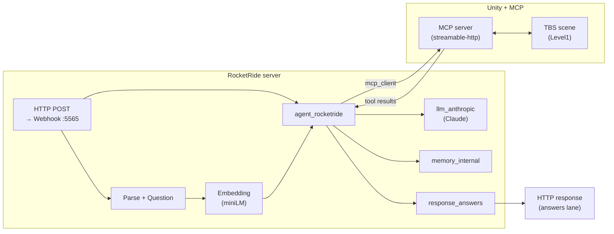
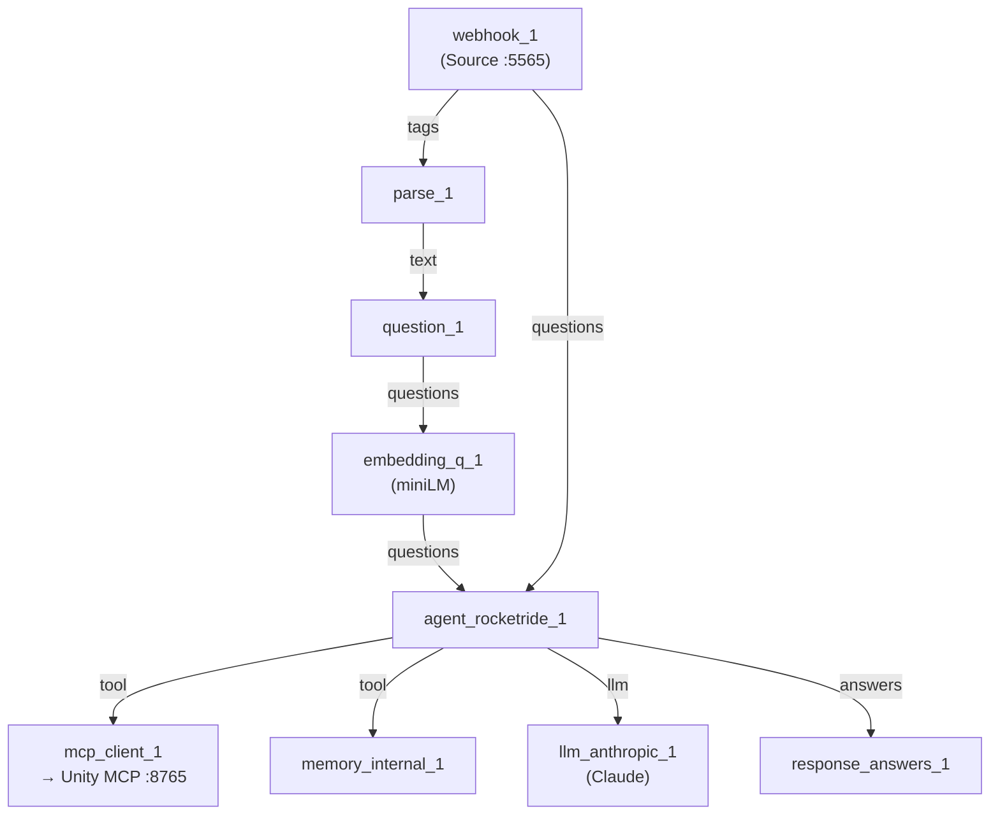

# Unity MCP + RocketRide capabilities

Unity tactical-battle sample that shows **Unity MCP** talking to a **RocketRide** pipeline via the bundled [`TBS-mcp.pipe`](Assets/StreamingAssets/pipelines/TBS-mcp.pipe) definition.

  
  &nbsp;
  
  &nbsp;
  
  &nbsp;
  

  
  &nbsp;
  

  <strong>Demo video:</strong> <strong>both images</strong> link to the <a href="https://www.instagram.com/p/DV4ZEQujEKr/">same Instagram reel</a> (Unity MCP, RocketRide, and Claude), where the video <strong>plays in the app or on instagram.com</strong>. GitHub cannot embed Instagram or reliably play video in the README.

**Author:** Ariel Vernaza ([@dsapandora](https://github.com/dsapandora)) — [ariel@lazyracoon.tech](mailto:ariel@lazyracoon.tech)

In this **prototype** the LLM (e.g. Claude) is called over a **remote API**: perceived latency is not only “inference time” but also **network, TLS, provider queuing, and token streaming**. With a **local** model (e.g. Ollama on loopback), the network segment shrinks almost to zero and the **machine GPU** usually becomes the bottleneck.

A **round-trip** decomposition for one tool invocation (MCP + pipeline + LLM) is:

$$
T_{\mathrm{RTT}} = T_{\mathrm{req}} + T_{\mathrm{srv}} + T_{\mathrm{LLM}} + T_{\mathrm{MCP}} + T_{\mathrm{resp}}.
$$

Here $T_{\mathrm{req}}$ and $T_{\mathrm{resp}}$ are HTTP request/response (remote paths include **WAN**); $T_{\mathrm{srv}}$ is pipeline orchestration; $T_{\mathrm{LLM}}$ bundles provider queue + cloud generation + streamed tokens back; $T_{\mathrm{MCP}}$ is MCP framing plus Unity.

Splitting what is attributable to **the wide-area path** versus a **local** deployment:

$$
T_{\mathrm{net}}^{\mathrm{WAN}} := T_{\mathrm{req}} + T_{\mathrm{resp}} + T_{\mathrm{TLS}} + T_{\mathrm{edge}}, \qquad
T_{\mathrm{net}}^{\mathrm{local}} \approx T_{\mathrm{loop}} \ll T_{\mathrm{net}}^{\mathrm{WAN}}.
$$

$$
T_{\mathrm{RTT}}^{\mathrm{remote}} = T_{\mathrm{net}}^{\mathrm{WAN}} + T_{\mathrm{srv}} + T_{\mathrm{LLM}}^{\mathrm{cloud}} + T_{\mathrm{MCP}}, \qquad
T_{\mathrm{RTT}}^{\mathrm{local}} = T_{\mathrm{net}}^{\mathrm{local}} + T_{\mathrm{srv}} + T_{\mathrm{LLM}}^{\mathrm{local}} + T_{\mathrm{MCP}}.
$$

The approximate **latency gain** when colocating the model with the game (same token load, comparable hardware) is

$$
\Delta = T_{\mathrm{RTT}}^{\mathrm{remote}} - T_{\mathrm{RTT}}^{\mathrm{local}}
\approx \bigl(T_{\mathrm{net}}^{\mathrm{WAN}} - T_{\mathrm{net}}^{\mathrm{local}}\bigr)
+ \bigl(T_{\mathrm{LLM}}^{\mathrm{cloud}} - T_{\mathrm{LLM}}^{\mathrm{local}}\bigr).
$$

## End-to-end workflow

High-level path from a chat/webhook request to a move in Unity and back to the client.

1. A client sends a payload to the **Webhook** source (port `5565` in the pipe).
2. **Parse** and **Question** shape the user text; **Embedding** enriches the **questions** lane for the agent.
3. **agent_rocketride** plans tool calls using **Claude** (**llm_anthropic**) and optional **memory_internal**.
4. **mcp_client** talks to the **Unity MCP** server (`http://localhost:8765/mcp` in the sample), which reads/writes the tactical battle state.
5. **response_answers** returns the pipeline output on the **answers** lane to the caller.

## RocketRide pipeline (`TBS-mcp.pipe`)

Topology of the nodes wired in [`Assets/StreamingAssets/pipelines/TBS-mcp.pipe`](Assets/StreamingAssets/pipelines/TBS-mcp.pipe) (data lanes `input` / control `control`).

### Pipeline schematic (visual overview)

## What is included

- Minimal Unity project folders required to run the sample (`Assets`, `Packages`, `ProjectSettings`).
- One gameplay scene for this sample: `Assets/TBSFramework/Examples/ClashOfHeroes/Scenes/Level1.unity`.
- RocketRide pipeline: `Assets/StreamingAssets/pipelines/TBS-mcp.pipe`.

## Run notes

1. Open this folder as a Unity project.
2. Ensure your RocketRide server is reachable.
3. Configure env vars (see `.env.example`) before starting the pipeline.
