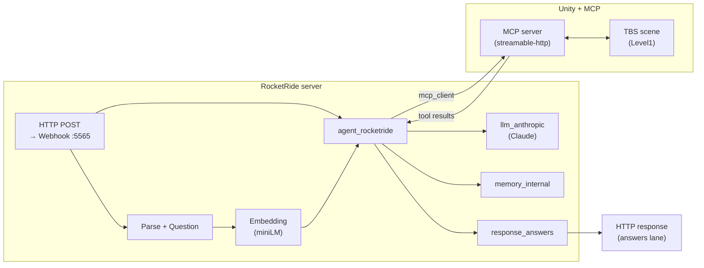
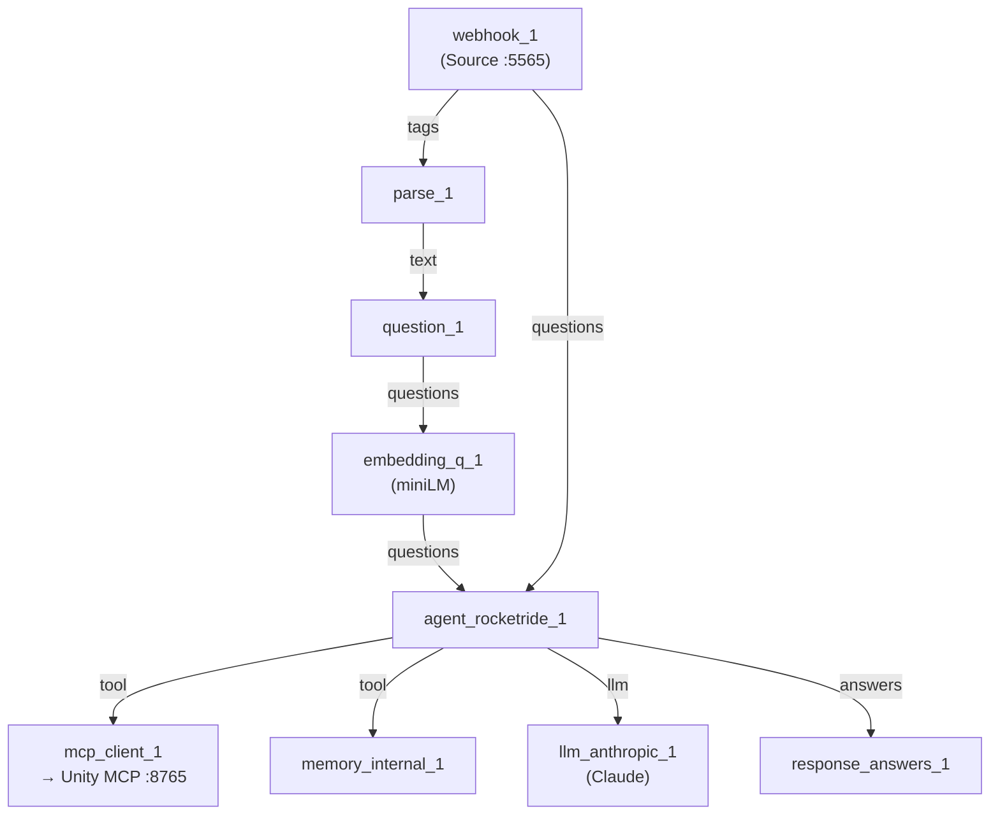

# Unity MCP + RocketRide capabilities

Unity tactical-battle sample that shows **Unity MCP** talking to a **RocketRide** pipeline via the bundled [`TBS-mcp.pipe`](Assets/StreamingAssets/pipelines/TBS-mcp.pipe) definition.

  
  &nbsp;
  
  &nbsp;
  
  &nbsp;
  

  
  &nbsp;
  

  <strong>Demo en vídeo:</strong> <strong>ambas imágenes</strong> llevan al <a href="https://www.instagram.com/p/DV4ZEQujEKr/">mismo reel en Instagram</a> (Unity MCP, RocketRide y Claude), donde el vídeo <strong>sí se reproduce</strong>. En GitHub no se puede incrustar el reproductor de Instagram ni fiarse del MP4 en la vista del archivo. 
  Sígueme en <a href="https://www.instagram.com/dsapandora/">Instagram @dsapandora</a> y en <a href="https://x.com/dsapandora">X @dsapandora</a>. Copia del grab en el repo: <a href="https://github.com/dsapandora/turn-based-strategy-mcp-server/blob/main/docs/demo-unity-mcp-rockeride.mp4"><code>docs/demo-unity-mcp-rockeride.mp4</code></a> (descarga / archivo; no como sustituto del reel).

**Author:** Ariel Vernaza ([@dsapandora](https://github.com/dsapandora)) — [ariel@lazyracoon.tech](mailto:ariel@lazyracoon.tech)

## Mathematical model (verified sketch)

Formal write-up and internal **equation check** live in [`docs/IEEE-conference-draft-intelligent-agents-mcp.md`](docs/IEEE-conference-draft-intelligent-agents-mcp.md). **LaTeX (IEEEtran) + PDF:** compile [`docs/ieee-paper/agent-mcp-rocketride.tex`](docs/ieee-paper/agent-mcp-rocketride.tex); step-by-step (Overleaf / MacTeX) and a verification table are in [`docs/ieee-paper/README.md`](docs/ieee-paper/README.md). *This machine has no `pdflatex` in CI; generate the PDF locally or on Overleaf.*

**Round-trip latency** (one MCP tool call through the pipeline):

$$
T_{\mathrm{RTT}} = T_{\mathrm{req}} + T_{\mathrm{srv}} + T_{\mathrm{LLM}} + T_{\mathrm{MCP}} + T_{\mathrm{resp}}.
$$

**Remote LLM (prototype, e.g. Claude API):** \(T_{\mathrm{req}}, T_{\mathrm{resp}}\) include **WAN + TLS**; \(T_{\mathrm{LLM}}\) includes **queue + cloud decode + streaming back**. That makes latency **transmission-heavy**. **Local LLM (e.g. Ollama on loopback):** the same decomposition holds but the network slice shrinks to near-loopback delays and the bottleneck usually moves to the **local GPU** (\(\rho_{\mathrm{GPU}}\)).

WAN vs. local **network slice** and **RTT split** (first-order):

$$
T_{\mathrm{net}}^{\mathrm{WAN}} := T_{\mathrm{req}} + T_{\mathrm{resp}} + T_{\mathrm{TLS}} + T_{\mathrm{edge}}, \qquad
T_{\mathrm{net}}^{\mathrm{local}} \approx T_{\mathrm{loop}} \ll T_{\mathrm{net}}^{\mathrm{WAN}}.
$$

$$
T_{\mathrm{RTT}}^{\mathrm{remote}} = T_{\mathrm{net}}^{\mathrm{WAN}} + T_{\mathrm{srv}} + T_{\mathrm{LLM}}^{\mathrm{cloud}} + T_{\mathrm{MCP}}, \qquad
T_{\mathrm{RTT}}^{\mathrm{local}} = T_{\mathrm{net}}^{\mathrm{local}} + T_{\mathrm{srv}} + T_{\mathrm{LLM}}^{\mathrm{local}} + T_{\mathrm{MCP}}.
$$

**Expected latency drop** when colocating the model (same token workload, comparable silicon):

$$
\Delta = T_{\mathrm{RTT}}^{\mathrm{remote}} - T_{\mathrm{RTT}}^{\mathrm{local}}
\approx \bigl(T_{\mathrm{net}}^{\mathrm{WAN}} - T_{\mathrm{net}}^{\mathrm{local}}\bigr)
+ \bigl(T_{\mathrm{LLM}}^{\mathrm{cloud}} - T_{\mathrm{LLM}}^{\mathrm{local}}\bigr).
$$

**Token throughput** bottleneck (tokens/s), network vs. decoder:

$$
\eta_{\mathrm{tok}} \leq \min\left( \frac{B_{\mathrm{net}}}{H_{\mathrm{tok}}},\ \rho_{\mathrm{GPU}} \right).
$$

**Cosine retrieval** (if \(\|\mathbf{e}\|_2=\|\mathbf{c}_i\|_2=1\), this reduces to the inner product):

$$
s_i = \frac{\mathbf{e}^{\top}\mathbf{c}_i}{\|\mathbf{e}\|_2\,\|\mathbf{c}_i\|_2}.
$$

**Tool choice** = pushforward of the token distribution under the parser \(\sigma^{-1}\); Boltzmann form is only a *descriptive* surrogate:

$$
\pi_\phi(\tau_t \mid o_t) = \sum_{y \in \mathcal{Y}_{\mathrm{valid}}:\,\sigma^{-1}(y)=\tau_t} P_\phi(y \mid o_t).
$$

**Unity transition** (simulator as deterministic black box):

$$
s_{t+1} = F_{\mathrm{Unity}}\bigl(s_t, \Psi(\tau_t)\bigr).
$$

## End-to-end workflow

High-level path from a chat/webhook request to a move in Unity and back to the client.

1. A client sends a payload to the **Webhook** source (port `5565` in the pipe).
2. **Parse** and **Question** shape the user text; **Embedding** enriches the **questions** lane for the agent.
3. **agent_rocketride** plans tool calls using **Claude** (**llm_anthropic**) and optional **memory_internal**.
4. **mcp_client** talks to the **Unity MCP** server (`http://localhost:8765/mcp` in the sample), which reads/writes the tactical battle state.
5. **response_answers** returns the pipeline output on the **answers** lane to the caller.

## RocketRide pipeline (`TBS-mcp.pipe`)

Topology of the nodes wired in [`Assets/StreamingAssets/pipelines/TBS-mcp.pipe`](Assets/StreamingAssets/pipelines/TBS-mcp.pipe) (data lanes `input` / control `control`).

### Pipeline schematic (visual overview)

## What is included

- Minimal Unity project folders required to run the sample (`Assets`, `Packages`, `ProjectSettings`).
- One gameplay scene for this sample: `Assets/TBSFramework/Examples/ClashOfHeroes/Scenes/Level1.unity`.
- RocketRide pipeline: `Assets/StreamingAssets/pipelines/TBS-mcp.pipe`.

## Run notes

1. Open this folder as a Unity project.
2. Ensure your RocketRide server is reachable.
3. Configure env vars (see `.env.example`) before starting the pipeline.
